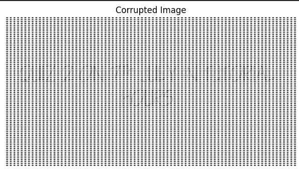
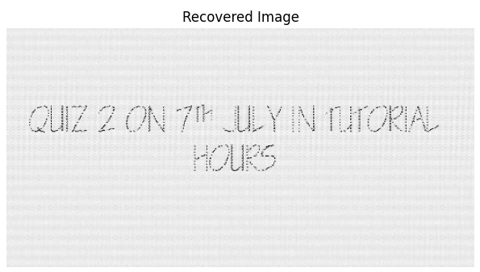
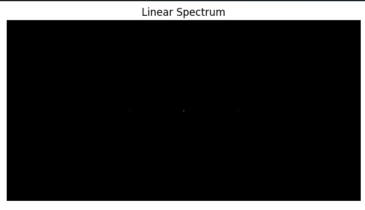
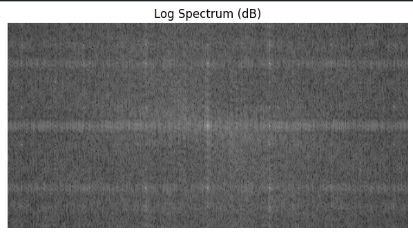
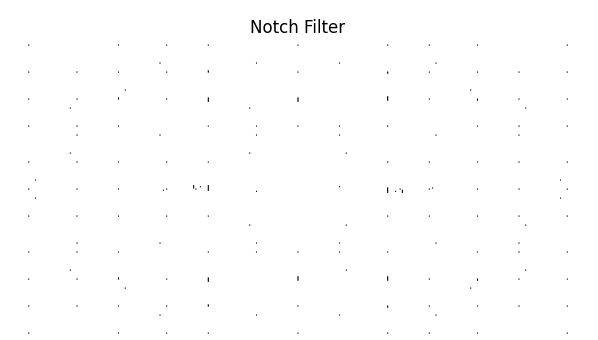
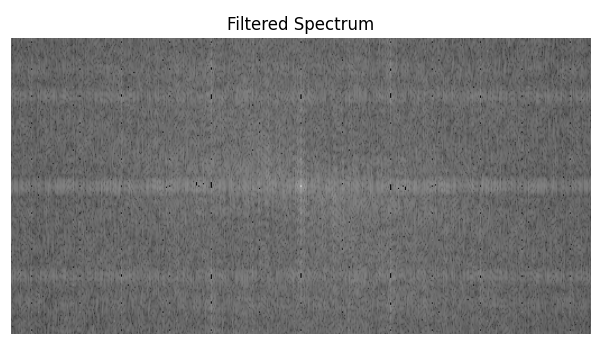
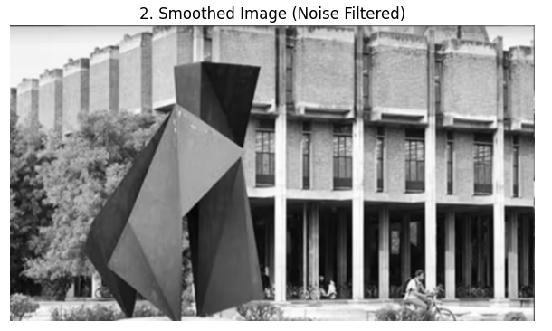
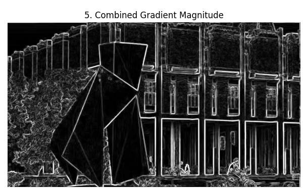
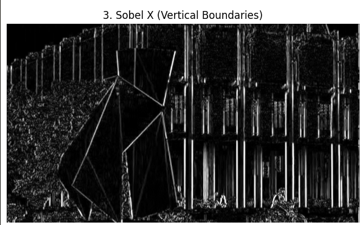
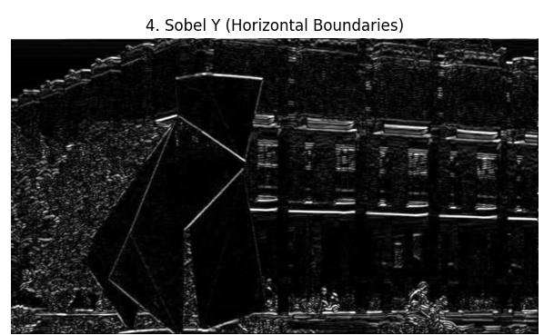

# EE200 Project: Frequency Forensics & Missing Boundaries

This project was completed as part of the **EE200 – Signals, Systems & Networks** course. It demonstrates two fundamental image processing applications using frequency-domain analysis and edge detection techniques.

---

# Project Overview

## Q1A – Frequency Forensics (The Ghost Signal)

### Objective
Recover a hidden message from a grayscale image corrupted by periodic noise using Fourier Transform techniques.

### Methodology
- Loaded the corrupted grayscale image.
- Computed the 2D Fast Fourier Transform (FFT).
- Shifted the spectrum to center low-frequency components.
- Visualized the frequency spectrum in both linear and logarithmic (dB) scales.
- Designed a notch filter to suppress periodic noise.
- Applied the filter in the frequency domain.
- Reconstructed the image using the Inverse FFT (IFFT).

### Techniques Used
- 2D FFT & FFT Shift
- Magnitude & Log (dB) Spectrums
- Notch Filtering
- Inverse FFT (IFFT)

### Restoration Results

| Corrupted Input Image | Recovered Output Image |
| :---: | :---: |
|  |  |

### Frequency Domain Analysis

| Linear Spectrum | Log Spectrum (dB) |
| :---: | :---: |
|  |  |

| Designed Notch Filter | Filtered Frequency Spectrum |
| :---: | :---: |
|  |  |

---

## Q1B – Missing Boundaries

### Objective
Detect object boundaries using Sobel edge detection after reducing image noise.

### Methodology
- Loaded the grayscale image.
- Applied image smoothing to reduce noise.
- Computed vertical gradients using Sobel-X.
- Computed horizontal gradients using Sobel-Y.
- Combined both gradients to obtain the final edge map.

### Techniques Used
- Image Smoothing
- Sobel X & Sobel Y Operators
- Gradient Magnitude Computation
- Edge Detection

### Edge Detection Pipeline

| Original Input | Smoothed Image | Combined Gradient Magnitude |
| :---: | :---: | :---: |
|  |  |  |

| Sobel X (Vertical Edges) | Sobel Y (Horizontal Edges) |
| :---: | :---: |
|  |  |

---

# Repository Structure

```text
EE200-Frequency-Forensics
│
├── images/
│   ├── q1a_corrupted_image.png
│   ├── q1a_linear_spectrum.png
│   ├── q1a_log_spectrum_db.png
│   ├── q1a_notch_filter.png
│   ├── q1a_filtered_spectrum.png
│   ├── q1a_recovered_image.png
│   ├── q1b_original_image.png
│   ├── q1b_smoothed_image.png
│   ├── q1b_sobel_x.png
│   ├── q1b_sobel_y.png
│   └── q1b_gradient_magnitude.png
│
├── Q1A_Frequency_Forensics.ipynb
├── Q1B_Missing_Boundaries.ipynb
├── EE200_Project_Report.pdf
├── README.md
└── requirements.txt
