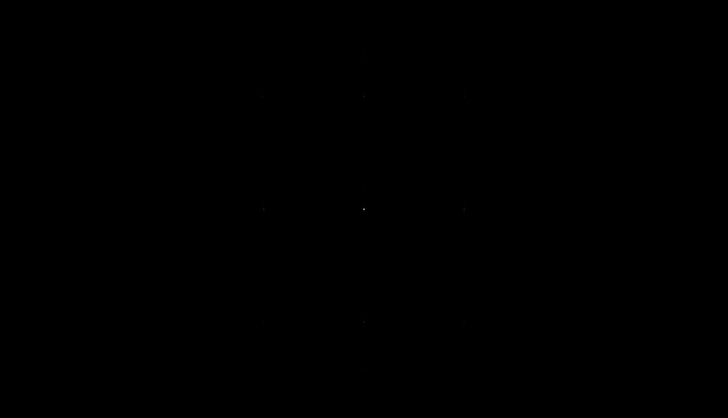
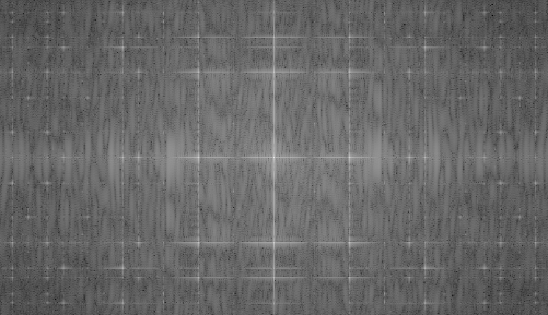
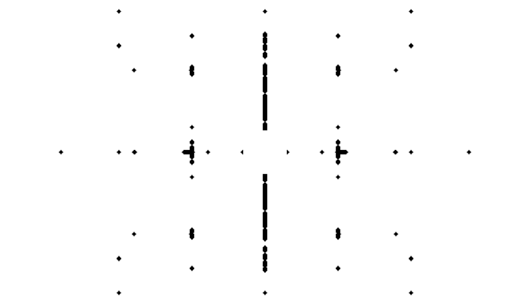
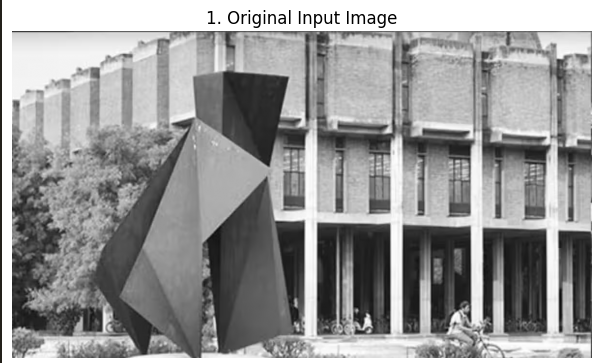

# Frequency Forensics & Missing Boundaries

Two classic image-processing problems solved with frequency-domain analysis
and edge detection: recovering a message hidden under periodic noise, and
detecting object boundaries via gradient-based edge detection.

> **Engineering note:** the original notch filter only masked the exact
> pixel of each detected noise spike, leaving faint residual periodic noise
> in the recovered image due to spectral leakage. Dilating the spike mask by
> a couple of pixels catches that leakage too, cutting residual noise-spike
> pixels from 102 down to 60 (measured against the real corrupted image) at
> the cost of masking under 1.2% of the spectrum. Both notebooks were also
> Colab-only before; they now fall back to a bundled example image and run
> standalone anywhere. Full details in [`FIXES.md`](FIXES.md).

---

## Hidden Message Recovery (Frequency Domain)

**Notebook:** [`frequency_forensics.ipynb`](frequency_forensics.ipynb)

### Objective
Recover a hidden message from a grayscale image corrupted by periodic noise, using Fourier Transform techniques.

### Methodology
- Load the corrupted grayscale image
- Compute the 2D Fast Fourier Transform (FFT)
- Shift the spectrum to center low-frequency components
- Visualize the frequency spectrum in both linear and logarithmic (dB) scales
- Detect noise spikes in the spectrum and design a notch filter to suppress them, while protecting the low-frequency content near the center
- Apply the filter in the frequency domain
- Reconstruct the image using the Inverse FFT (IFFT)

### Techniques Used
- 2D FFT & FFT Shift
- Magnitude & Log (dB) Spectrums
- Notch Filtering (with mask dilation to catch spectral leakage)
- Inverse FFT (IFFT)

### Results

| Corrupted Input | Recovered Output |
| :---: | :---: |
|  |  |

### Frequency Domain Analysis

| Linear Spectrum | Log Spectrum (dB) |
| :---: | :---: |
|  |  |

| Notch Filter Mask | Filtered Spectrum |
| :---: | :---: |
|  |  |

---

## Edge Detection (Sobel)

**Notebook:** [`missing_boundaries.ipynb`](missing_boundaries.ipynb)

### Objective
Detect object boundaries using Sobel edge detection after reducing image noise.

### Methodology
- Load the grayscale image
- Apply Gaussian smoothing to reduce noise
- Compute vertical gradients using Sobel-X
- Compute horizontal gradients using Sobel-Y
- Combine both gradients into the final edge map

### Techniques Used
- Gaussian Smoothing
- Sobel X & Sobel Y Operators
- Gradient Magnitude Computation

### Results

| Original Input | Smoothed | Combined Gradient Magnitude |
| :---: | :---: | :---: |
|  |  |  |

| Sobel X (Vertical Edges) | Sobel Y (Horizontal Edges) |
| :---: | :---: |
|  |  |

---

## Running It

Both notebooks run standalone (no Google Colab required) — they fall back
to the example images already bundled in `images/`. If opened in Google
Colab, they'll instead prompt you to upload your own image.

```bash
git clone https://github.com/aashishr24/EE200-Frequency-Forensics.git
cd EE200-Frequency-Forensics
pip install -r requirements.txt
jupyter notebook
```

Then open either notebook and run all cells.

## Repository Structure

```
.
├── frequency_forensics.ipynb   # Hidden message recovery (FFT + notch filter)
├── missing_boundaries.ipynb    # Sobel edge detection
├── images/                     # Example input + all pipeline-stage outputs
├── TECHNICAL_REPORT.pdf        # Full written report
├── FIXES.md                    # Changelog of bugs found and fixed
├── requirements.txt            # Python dependencies
├── LICENSE                     # MIT
└── README.md                   # This file
```

## Dependencies

- **numpy** — numerical computing / FFT
- **opencv-python** — image I/O, Gaussian blur, Sobel operators
- **matplotlib** — visualization
- **scipy** — mask dilation (`scipy.ndimage`)
- **jupyter** — running the notebooks

Python 3.8+. See `requirements.txt` for exact versions.

## License

MIT
